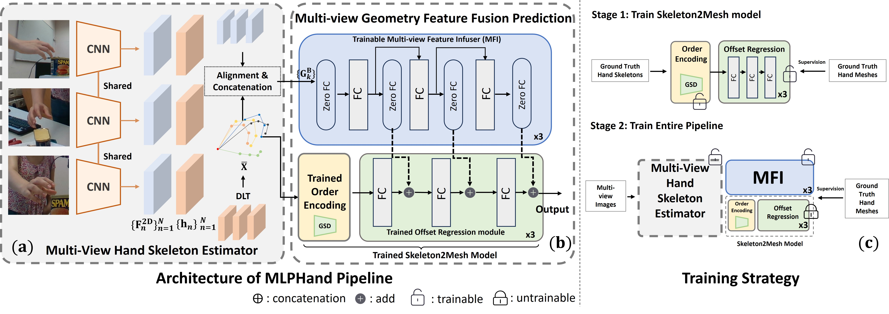

<!-- PROJECT LOGO -->

<p align="center">

  <h1 align="left">MLPHand: Real Time Multi-view 3D Hand Reconstruction via MLP Modeling</h1>
  <p align="center">
    <a><strong>Jian Yang</strong></a>
    ·
    <a><strong>Jiakun Li</strong></a>
    ·
    <a><strong>Guoming Li</strong></a>
    ·
    <a><strong>Huaiyu Wu</strong></a>
    ·
    <a><strong>Zhen Shen</strong></a>
    .
    <a><strong>Zhaosin Fan</strong></a>
    .
  </p>
  <h2 align="center">ECCV 2024</h2>
  <div align="center">
    
  </div>

  <p align="center">
    <br>
    <a href="https://www.ecva.net/papers/eccv_2024/papers_ECCV/papers/09503.pdf">
      
    </a>
  </p>
</p>

Multi-view hand reconstruction is a critical task for applications in virtual reality and human-computer interaction, but it remains a
formidable challenge. Although existing multi-view hand reconstruction
methods achieve remarkable accuracy, they typically come with an intensive computational burden that hinders real-time inference. To this end,
we propose MLPHand, a novel method designed for real-time multi-view
single hand reconstruction. MLPHand consists of two primary modules:
(1) a lightweight MLP-based Skeleton2Mesh model that efficiently recovers hand meshes from hand skeletons, and (2) a multi-view geometry feature fusion prediction module that enhances the Skeleton2Mesh
model with detailed geometric information from multiple views. Experiments on three widely used datasets demonstrate that MLPHand can
reduce computational complexity by 90% while achieving comparable reconstruction accuracy to existing state-of-the-art baselines. Project link
is https://github.com/jackyyang9/MLPHand
<br/><br/>

**Congratulations on our paper being accepted by ECCV 2024!!**

The code will be released soon in next few weeks!

Todo list:
  1. - [x] Share the convex decomposition matrix. See `Diag_Vertex.pth`
  2. - [x] Training/Inference code of stage 1 (2025/2/24)
  3. - [ ] Training/Inference code of stage 2 (As soon as possible **:)**)


## Instructions

- See [docs/installation.md](docs/installation.md) to setup the environment and install all the required packages.
- See [docs/datasets.md](docs/datasets.md) to download all the datasets and data assets.

&nbsp;

## Training and Evaluation


### Stage 1

Simply running ```HM_trainv2.py``` would start the training and evalution proceess of our Skeleton2Mesh model. ( ***Note*** that this HM_trainv2.py script has not been carefully cleaned. If you have any question or meet any problem, welcome to post issues)

### Stage 2

***Coming Soon !***

&nbsp;

## License

The code and model provided herein are available for usage as specified in [LICENSE](LICENSE) file. 
By downloading and using the code and model you agree to the terms in the [LICENSE](LICENSE).

## Reference
Most of codes come from the [**POEM**](https://github.com/lixiny/POEM) repo, We deeply thank this repo.

## Citation

```bibtex
@inproceedings{yang2024mlphand,
  title={MLPHand: Real Time Multi-view 3D Hand Reconstruction via MLP Modeling},
  author={Yang, Jian and Li, Jiakun and Li, Guoming and Wu, Huai-Yu and Shen, Zhen and Fan, Zhaoxin},
  booktitle={European Conference on Computer Vision},
  pages={407--424},
  year={2024},
  organization={Springer}
}
```

For more questions, please contact Jian Yang: jianyang0227@gmail.com
