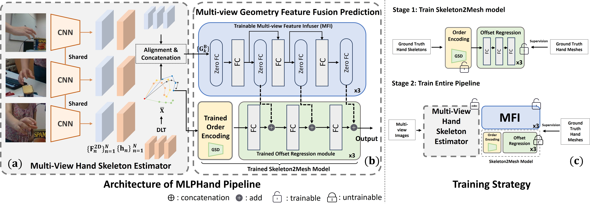

# MLPHand



This is the official GitHub repository for the paper "MLPHand: Real-Time Multi-View 3D Hand Mesh Reconstruction via MLP Modeling". 

**Congratulations on our paper being accepted by ECCV 2024!!**

The code will be released soon in next few weeks!

Todo list:
  1. - [x] Share the convex decomposition matrix.
  2. - [ ] Training/Inference code of stage 1
  3. - [ ] Training/Inference code of stage 2

  
```
@article{yang2024mlphand,
  title={MLPHand: Real Time Multi-View 3D Hand Mesh Reconstruction via MLP Modeling},
  author={Yang, Jian and Li, Jiakun and Li, Guoming and Shen, Zhen and Wu, Huai-Yu and Fan, Zhaoxin and Huang, Heng},
  journal={arXiv preprint arXiv:2406.16137},
  year={2024}
}
```
